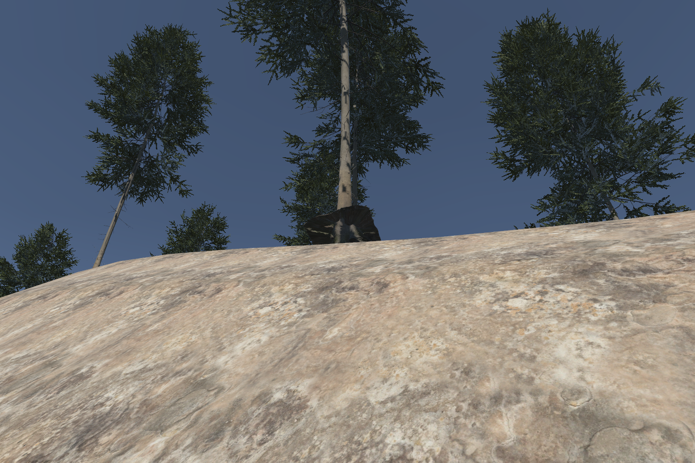
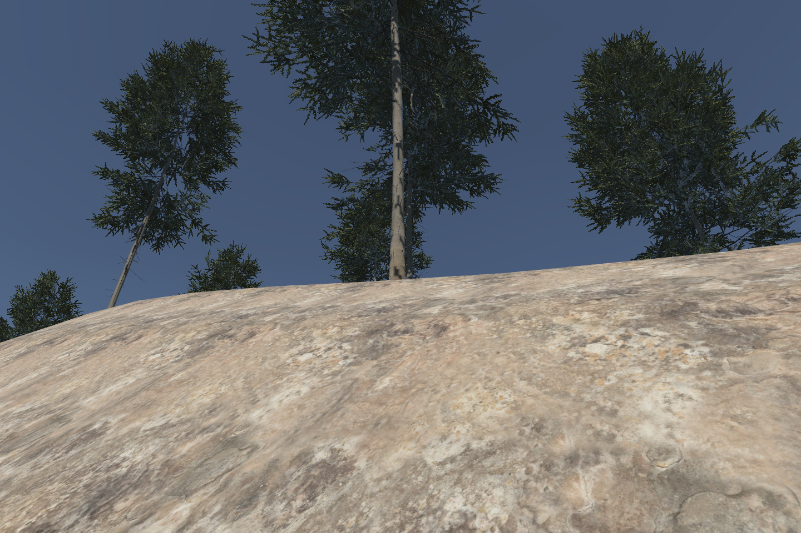
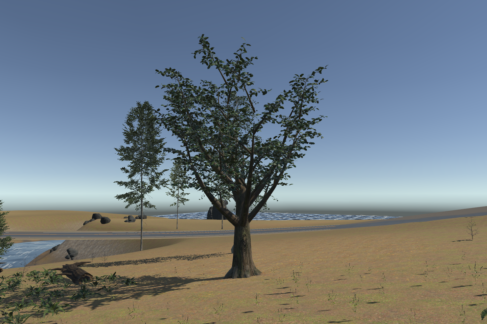
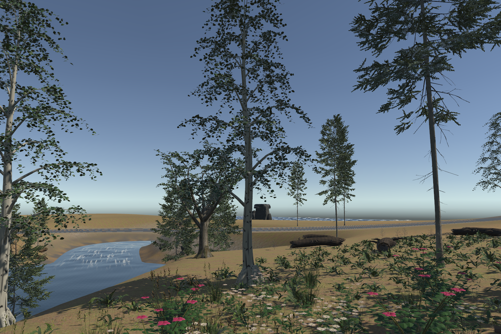
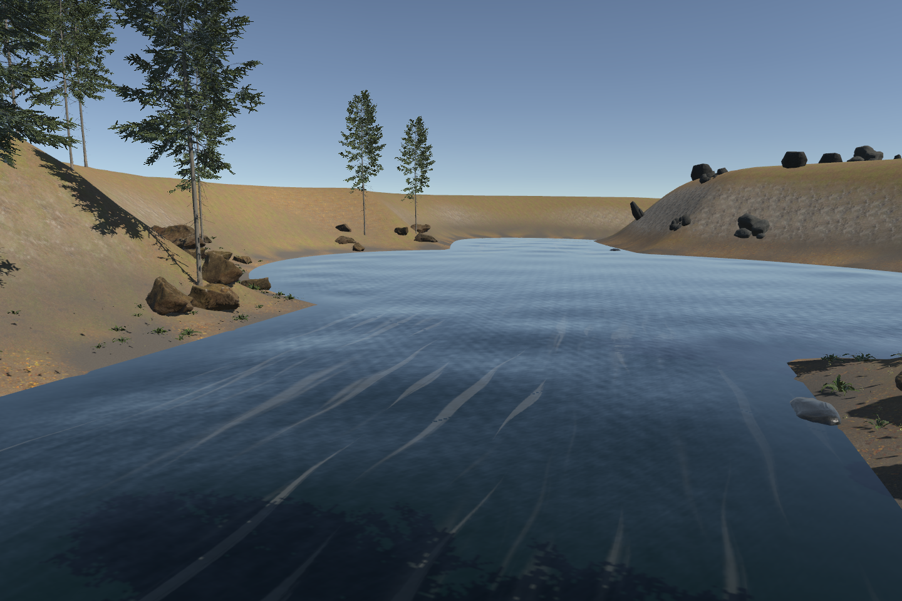
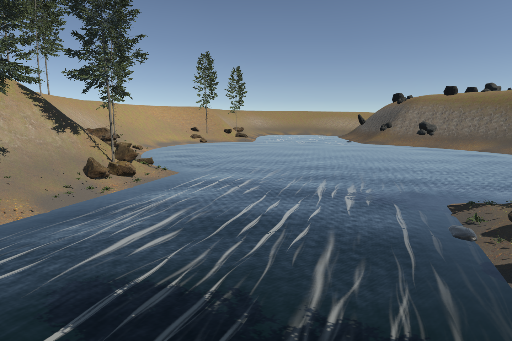
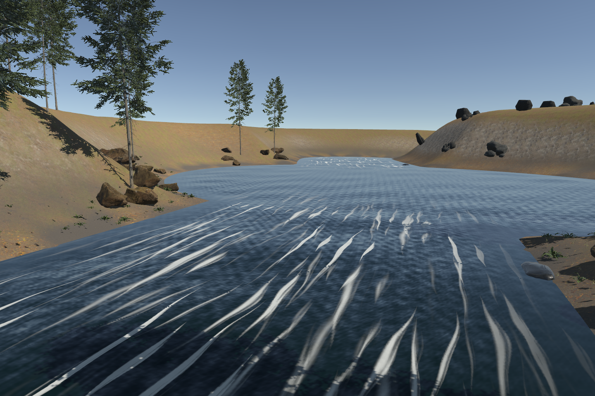
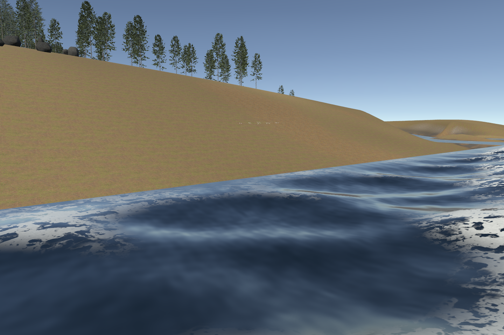

# Nature detail 0.6 — sandbox review

This pass reduces terrain repetition, improves upright tree contact on slopes, adds oak B and birch B, and refines river and ocean foam. The assembled Unity sandbox captures are reviewed. The combined Editor milestone passed 157/157; six terrain cases passed after the final sampling refinements. This does not establish device performance or NatureManufacture visual parity. Earlier [0.5 evidence](NATURE_05.md) remains separately versioned.

## Terrain: less repetition with an explicit cost

`antiTiling=true` blends three seeded translations of each eligible source texture. Color, unpacked normals and masks share coordinates and weights. Original UV derivatives keep mip selection stable. A broad, bounded albedo field breaks up larger uniform regions without resizing the physical leaves and stones in the scans. Native Terrain geometry, holes, lighting and layer height blending remain in place; the adapted distant basemap is rebuilt after painting.

| View | Native | Stochastic |
|---|---|---|
| Near ground | [Native near](../images/fidelity-06-terrain-native-near.png) | [Stochastic near](../images/fidelity-06-terrain-stochastic-near.png) |
| Far detail | [Native far](../images/fidelity-06-terrain-native-far.png) | [Stochastic far](../images/fidelity-06-terrain-stochastic-far.png) |
| Distant basemap | [Native basemap](../images/fidelity-06-terrain-native-basemap.png) | [Stochastic basemap](../images/fidelity-06-terrain-stochastic-basemap.png) |

| Recipe field | Default | Control |
|---|---:|---|
| `antiTiling` | `true` | Set `false` to restore native Terrain Lit sampling. |
| `appearanceSeed` | `731` | Pattern translations and broad color variation; does not change terrain or classification. |
| `stochasticCellTiles` | `1.0` | Translation cell size in source repeats; range 1–8. |
| `macroScaleMeters` | `37` | Broad color scale; range 8–256 metres. |
| `macroVariation` | `0.28` | Albedo multiplier deviation; range 0–0.5. |

The existing `seed` still controls layer classification. Use the otherwise identical package samples `terrain-paint-native-comparison.json` and `terrain-paint-stochastic.json` to compare sampling modes. `bwork_terrain_surface_view` exposes `surface`/`near`/`far` views and `detail`/`basemap`/`natural` representation, restoring the authored basemap distance after each capture. The published near pair uses `surface`, a camera three metres above the ground aimed downward; `near` retains the earlier landscape bookmark. The reviewed one-repeat cells reduce repetition more visibly than the initial 2.6-repeat cells, although recognizable motifs remain.

Four-layer woodland/coast/cliff surfaces require **up to 36 material samples versus 12**: color, normal and mask, each at three translations. Temperate uses up to 30 because its 90 m aerial outcrop stays single-sampled. Control maps, shadows and native lighting add their own samples. Macro variation adds arithmetic, not textures. Distant basemap synthesis pays the extra adapted color/mask cost during rebuilding; distant rendering consumes the baked map.

This is translation blending, not histogram-preserving synthesis. Some contrast loss and recognizable motifs remain possible. It preserves native XZ projection: **no triplanar projection is added**, and steep rock can still stretch. The adapter checks the exact installed URP 17.6 baseline and retains its license notice; it generates derived shader files locally rather than redistributing Unity source as original MIT work. Device cost is unmeasured.

## Trees: grounded bases and additive variants

| Slope contact before | Root support after |
|---|---|
|  |  |

The low root collar across all LODs defines a support footprint. Placement lowers the upright tree within a bounded allowance or rejects an unsuitable site. It does not tilt the tree or change Terrain heights. The bounded before/after fixture lowered its tree by **1.1612 m** while all **66,049** sampled Terrain heights remained unchanged; this one result does not establish arbitrary-slope contact. Existing exclusions, scale and deterministic placement rules remain relevant.


| Oak B | Birch B |
|---|---|
|  |  |

`bfjord:MatureOak_B` and `bfjord:SilverBirch_B` add finer twigs, varied leaf roll and color, fused large branches and root collars. Birch keeps a slender leader and drooping sprays. Oak bark uses the verified CC0 [Bark Brown 02 scan](https://polyhaven.com/a/bark_brown_02) by Rob Tuytel; birch bark and leaves remain original procedural art. Powered by Poly Haven; its [CC0 license](https://polyhaven.com/license) permits reuse and redistribution. Private reference images are not generator inputs.

| Model | Reimported LOD0 / LOD1 / LOD2 triangles | Conservative recipe crown radius |
|---|---|---:|
| MatureOak_B | 141,264 / 60,980 / 19,637 | 5.3 m |
| SilverBirch_B | 101,204 / 53,476 / 18,776 | 3.8 m |

The three shared 2048² maps are base color, tangent-space normal and metallic/smoothness. Models use one material slot; three LODs retain their wind root and existing 0.22 m canopy amplitude. Source byte counts and triangles do not establish GPU residency or iPad performance. The catalog adds B identities and leaves A models, their hashes and existing prepared prefab generations intact. Repeated branch forms and some bark UV transitions remain visible.

The current catalog has 260 admitted files and 26 library variants. Build the library and apply the public 0.6 sample:

```sh
python3 scripts/bfjord.py run --project Examples~/SandboxProject --request recipes/foliage-assets.json
python3 scripts/bfjord.py run --project Examples~/SandboxProject --request recipes/woodland-canopy-06.json
```

The request applies `Packages/com.bfjord.tools/Samples/woodland-canopy-06.json` to `canopy`, replacing that named batch. It uses seed 51915, a candidate cap of 44 and weights of 40% oak B, 38% birch B and 22% retained fir. Change the batch ID to keep the old placements; neighbors and exclusions can reduce the new count. Source generators are in `scripts/foliage_detail`; the exported [Blender review image](../../assets/BFjordTools/FoliageDetail/Woodland06/Review/woodland-assets.png) and verified bark source receipt remain under `assets/BFjordTools/FoliageDetail/Woodland06`. Editable `.blend` files stay outside the public snapshot; generators and the CC0 source maps recreate them.

## Water: finer strands and torn foam film

| Low river flow | Medium river flow | High river flow |
|---|---|---|
|  |  |  |



River aeration follows tapered downstream strands with uneven width and small splits. Ocean foam mixes coarse coverage, torn connected edges and fine porosity, leaving dark water between patches. Existing coverage contributions combine by maximum instead of filling whole regions through addition. These are visual appearance changes, not a physical fluid simulation.

Two original 512² maps replace the prior river/ocean patterns. The pass adds **no texture samples, bindings, render targets or geometry**. Existing analytic wave normals, bounded displacement and the installed 0.95 m ocean envelope remain unchanged. Low/medium/high appearance controls, seeded offsets and independent surface ownership remain in place. There is no overturning lip or volumetric spray.

[River motion](../clips/fidelity-06-river.mp4) and [ocean motion](../clips/fidelity-06-ocean.mp4) show captured Unity output. Capture encoding rates are not measured rendering performance. Review downstream travel, phase fading, narrow strand visibility and dark water between foam patches. Source checks and prior-version tests are not substitutes for this assembled review.

## Evidence boundary

Blender reimport checks confirm six finite, nondegenerate triangle meshes with UVs and finite tangents. Exact model/texture/generator hashes and the original v0.5 model hashes were checked; new catalog files contain no local-user or private-reference paths. Source terrain checks and water-map structure checks are recorded by their authors. The combined Editor milestone passed **157/157 in 97.85 seconds** with no skips or failures, including ten root-support cases and six terrain cases. After final sampling defaults and the close camera were refined, **TerrainAntiTilingTests passed 6/6 in 11.65 seconds**. The final water fragment/maps were reviewed after that combined snapshot: three final motion-map tests pass, actual Metal captures report zero water shader errors, and all 48 river / 72 ocean frames have unique hashes. Clips encode four and six seconds at 12 fps; this is capture timing, not render performance.

Final terrain pairs report zero shader errors, with **66,049 heights and 262,144 layer values unchanged**. Reapplying the canopy batches also preserved all heights. Both video files decode in the review browser. The remaining limitations are native slope stretching, some muted contrast and repeated tree forms, stylized river ribbons and broad ocean foam sheets; no fluid solver, overturning wave geometry, whole-island validation or iPad benchmark was introduced.

The final appearance-seed check applied 731 → 732 → 731 while preserving all heights and layer values. Different seeds changed the image clearly (mean red-channel difference 14.19/255); repeating 731 was visually stable (0.012/255 across the whole frame, below 0.0003/255 on the bare-ground strip). Full scene PNG bytes are not guaranteed identical because distant foliage/shadow rendering contributes tiny differences. This is appearance reproducibility, not a bit-exact renderer guarantee.
