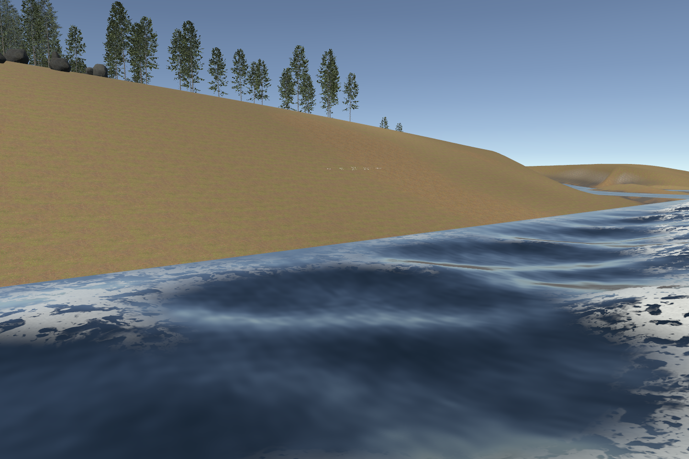
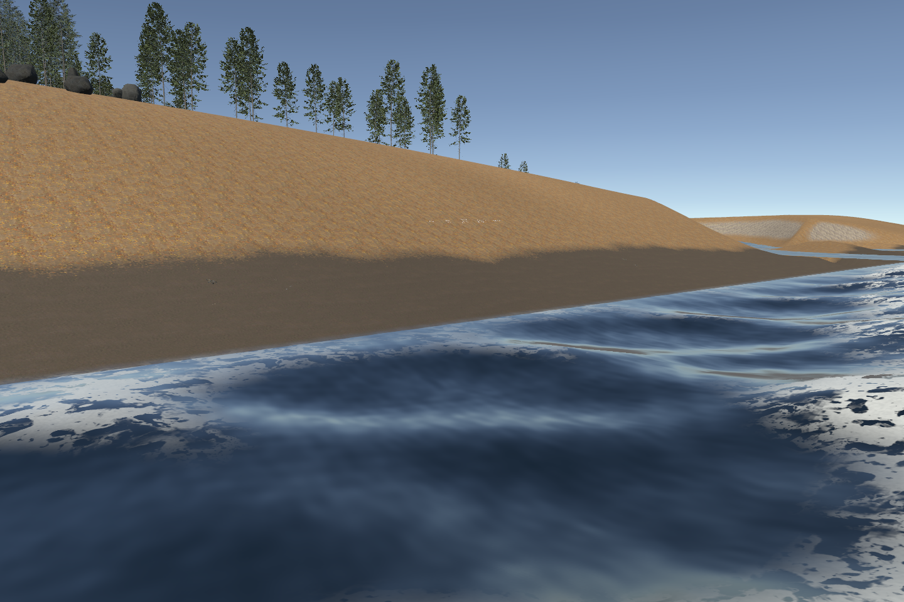
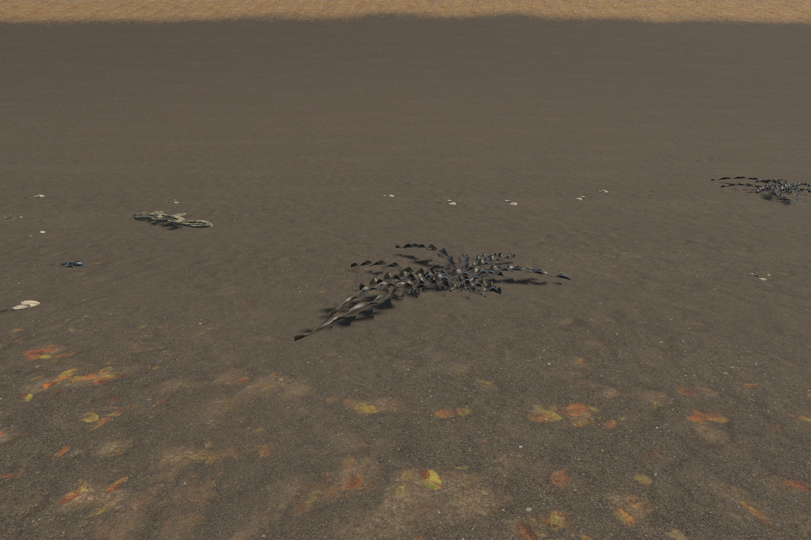
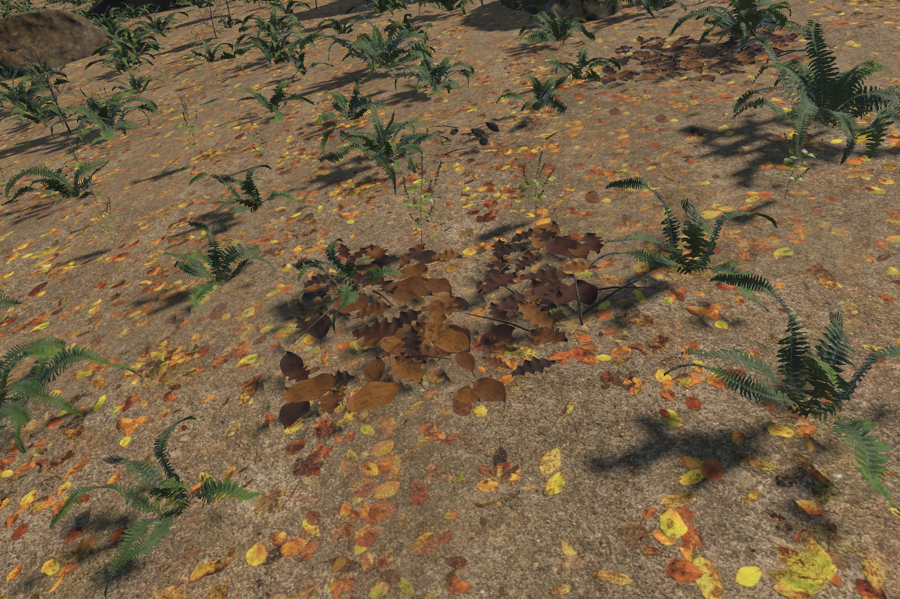
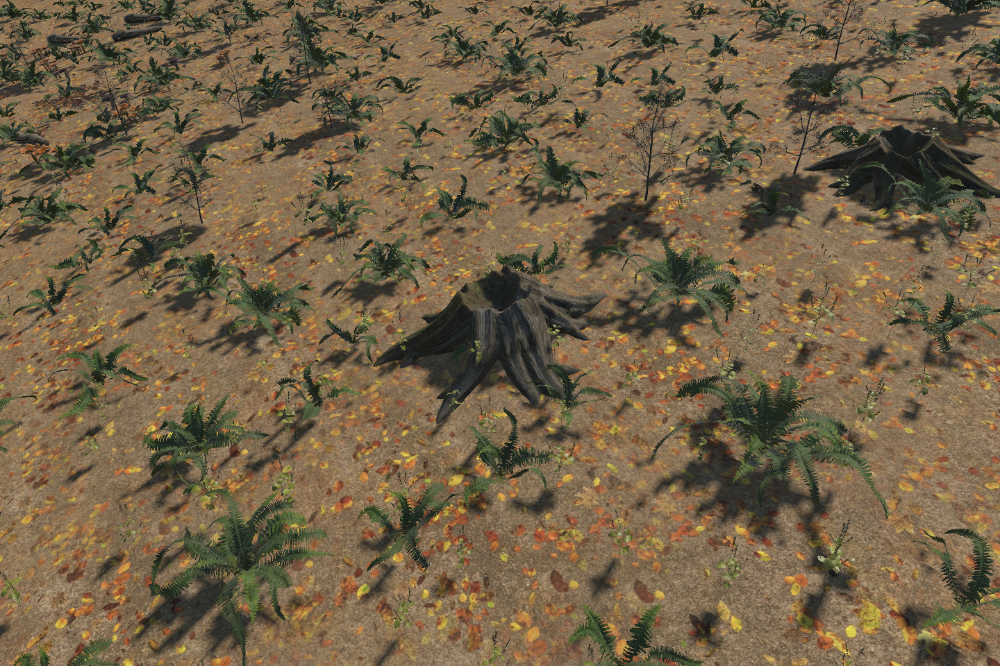
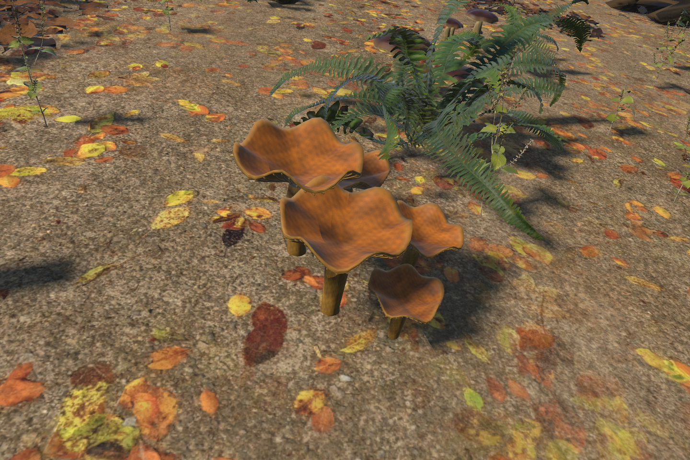
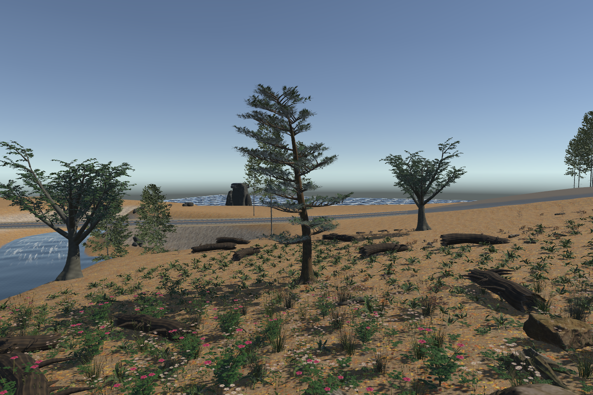
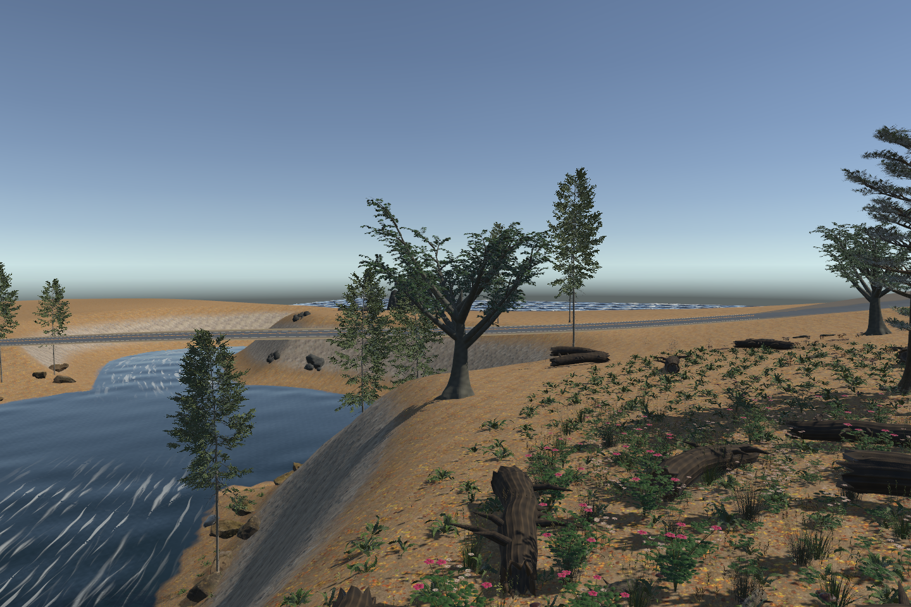

# Beach and forest floor — 0.7.0

This sandbox pass adds scanned sand with independent dry/wet appearance, six shore props, seven ground specimens and three tree families. It softens water contact with depth/footprint transparency and shallow optical absorption. The coastline and water geometry remain fixed.

| Before | After |
|---|---|
|  |  |

The comparison uses the same camera and water time of 2 seconds. The after frame includes updated sand classification, wetness, contact shading and shoreline props. The [six-second Unity shoreline clip](../clips/fidelity-07-shore.mp4) contains 72 distinct 1440×960 frames encoded at 12 fps; that is an offline capture rate, not rendering performance.

## Assets and placement

- Shore: cockle and mussel shells, shell fragments, kelp, bladder wrack and bleached driftwood. 220 seeded placements near water, with road/water exclusions and slope alignment.
- Forest floor: exposed root fan, curled oak/birch litter, pine litter/cones, brown boletes, golden chanterelles, shelf fungi/deadwood and mossy fallen branch. 280 ground placements and 16 root clusters.
- Trees: giant redwood, coastal pine and mature beech; four trees fit the existing mixed woodland clearances and six redwoods occupy suitable clearings in the larger sandbox. Trunks stay upright and root footprints retain the support check.
- The prepared foliage library has 42 variants; old IDs and prefab generations remain valid. The source catalog has 342 files. Every new model has three LOD meshes and one atlas material slot.

| Shore details | Ground litter |
|---|---|
|  |  |

| Exposed roots | Chanterelles |
|---|---|
|  |  |

| Redwood | Pine | Beech |
|---|---|---|
|  |  |  |

## Tool use

Restore the current asset catalog with `python3 scripts/bfjord.py prepare-project --project /path/to/sandbox`, then use the resident Unity commands:

```text
bwork_foliage action=build-assets
bwork_terrain action=paint recipePath=Packages/com.bfjord.tools/Samples/shoreline-terrain.json
bwork_foliage action=apply batchId=canopy recipePath=Packages/com.bfjord.tools/Samples/woodland-canopy-07.json
bwork_foliage action=apply batchId=redwood-grove recipePath=Packages/com.bfjord.tools/Samples/redwood-grove-07.json
bwork_foliage action=apply batchId=forest-floor recipePath=Packages/com.bfjord.tools/Samples/forest-floor-07.json
bwork_foliage action=apply batchId=forest-roots recipePath=Packages/com.bfjord.tools/Samples/forest-roots-07.json
bwork_foliage action=apply batchId=shore-wrack recipePath=Packages/com.bfjord.tools/Samples/shore-wrack-07.json
bwork_water_fidelity preset=medium
```

The shoreline palette uses four layers: ForestLitter, DrySand, WetSand and RockFace. Dry/wet share the 2.1 m sand scan and differ through tint, smoothness and normal strength. Ocean-distance, elevation and slope limit the sand habitat; inner plateaus and smooth outer fades avoid a thin isolated stripe. Existing palettes remain available. `alignToSurface` is opt-in for ground details; canopy alignment is rejected. Shell/litter offsets are millimetres, and sample exclusion radii cover the complete tilted geometry. Seeds remain explicit.

## Validation

The combined Editor milestone passed **172/172 tests in 96.86 seconds**, with no failures, skips or inconclusive results. Added checks cover alignment/default replay, canopy restrictions, terrain holes, shoreline gates and mirrored tangent baking. Actual assembly retained **66,049 terrain heights, 65,536 hole samples and canonical water nodes/reaches**. Water shader diagnostics contain no errors.

Integration caught an invalid imported root-LOD tangent basis. Coordinate baking now derives MikkTSpace tangents from the final geometry/UVs and validates them. A source color-encoding regression was also corrected: the two sand color maps preserve the scan's encoded pixels within one 8-bit step. All 342 catalog entries are hash-checked before publication. The library and representative Unity frames were inspected separately from Blender source reviews.

The generator scripts support both source and public checkout layouts. Manifests retain hashes of the generating scripts at asset export; subsequent path-only portability changes do not imply the asset bytes were regenerated. Editable Blender scenes stay local; the public repository includes the generators and licensed dependencies.

## Visual limits

The wet band and ground props improve the sample, but the retained test terrain has broad angular slopes and a conspicuously straight water contact edge. Its wet band is still broad, foam glossy, small props visibly faceted, and tree crowns stylized/sparse. Root fans read as eroded stumps. Further beach landform authoring, bark/leaf work and lighting are needed for realistic scene parity. No device performance, production island integration or fluid-simulation claim is made.

## Sources

- [Poly Haven Sand 02](https://polyhaven.com/a/sand_02) and its [CC0 license](https://polyhaven.com/license): pinned sand maps and provenance ship with the assets.
- [Unity TerrainLayer](https://docs.unity3d.com/6000.0/Documentation/ScriptReference/TerrainLayer.html): native layer remaps and shared textures.
- [Unity Scene Depth](https://docs.unity.cn/Packages/com.unity.shadergraph%4017.4/manual/Scene-Depth-Node.html): transparent contact shading with a camera depth texture.
- [Unity tangent generation](https://docs.unity3d.com/cn/6000.0/ScriptReference/ModelImporterTangents.html): MikkTSpace basis handling.

Geometry and original atlases are CC0; scripts are MIT. Commercial reference images remain private and are not repository dependencies.
