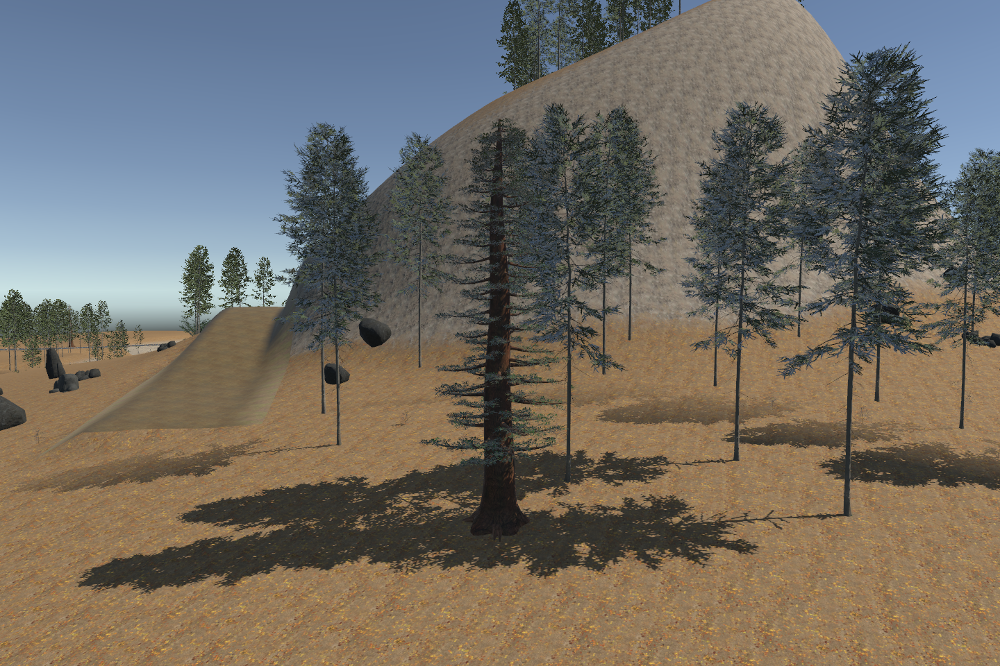
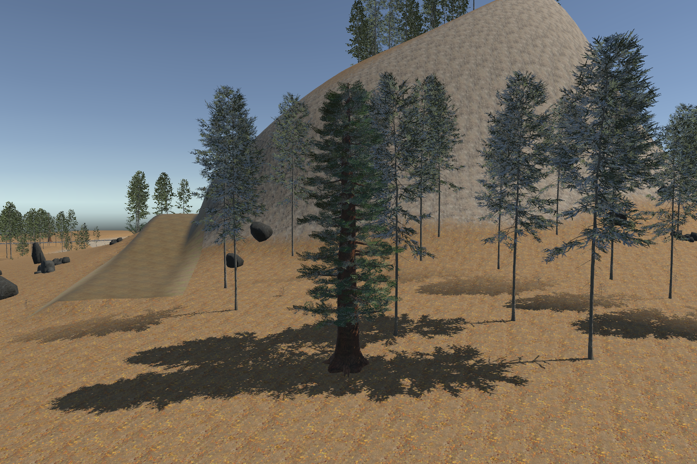
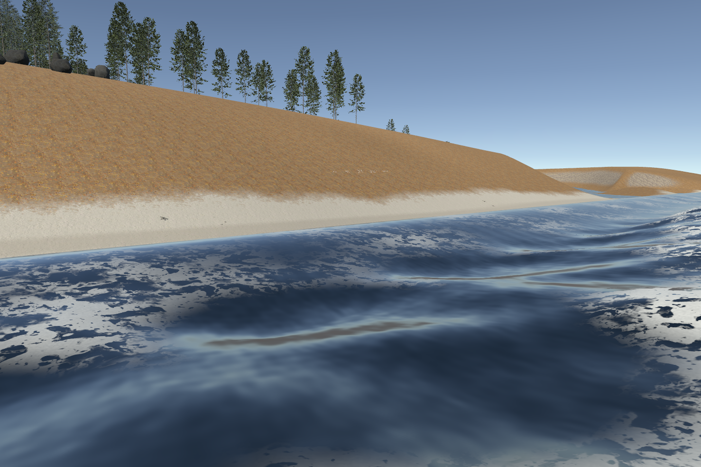
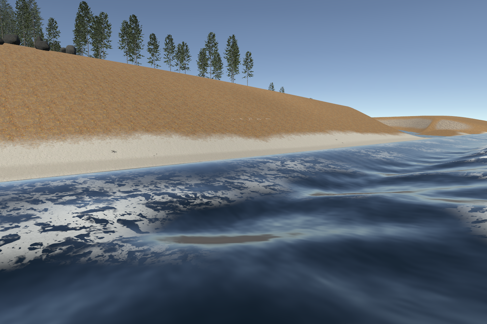
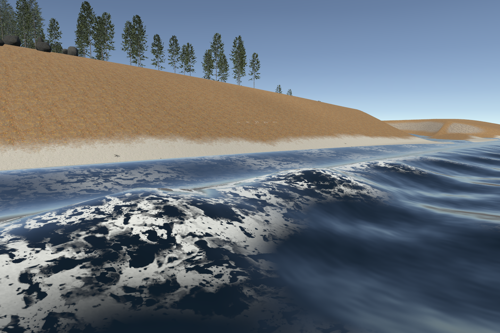
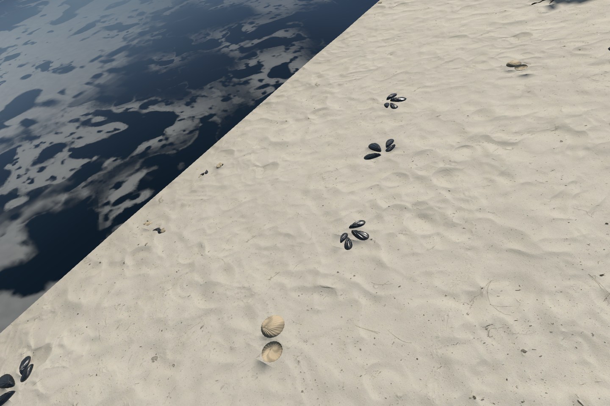

# Pale sand, moving shore wash and fuller redwoods — 0.8.0

This revision addresses the sparse redwood crown, dark beach material and visually pinned waterline in the 0.7 sandbox. It keeps the canonical terrain and water network intact while changing the rendered shore surface.

## What makes the sand more convincing

The private reference photographs show pale mineral sand, restrained small-scale variation, scattered deposits and a gradual transition to wet sand. Higher texture resolution alone cannot produce that appearance. The material needs matched color, normal, height and roughness maps at the same physical scale; fine relief must survive without becoming giant gravel. Large-area variation and small shells/wrack break repetition. Beach shape and lighting remain separate art tasks.

The new source is [ambientCG Ground 052](https://ambientcg.com/view?id=Ground052), a white beach material created through surface photogrammetry, covering approximately 2 × 2 metres. Its [CC0 license](https://docs.ambientcg.com/license/) permits shipping the source maps and derivatives with this repository. The source receipt records downloaded files and hashes. The installed material uses bounded 2K maps and the existing terrain anti-tiling path, without adding terrain texture samples.

[Poly Haven's texture standards](https://docs.polyhaven.com/en/technical-standards/textures) explain why calibrated color, measured scale, seamless channels and matched surface maps matter. [Unity Terrain Layers](https://docs.unity3d.com/6000.0/Documentation/Manual/class-TerrainLayer.html) provide the shared texture scale and wet/dry channel remaps used here. This is a reference-informed PBR improvement, not a claim of AAA production parity.

## Shoreline motion

The old surface ended at its fixed wet-field boundary and faded displacement to zero there. The new opt-in visual apron extends beyond that boundary and animates a shallow runup wave against the actual terrain depth. The visible waterline can advance and retreat instead of only scrolling foam. The default demonstration uses an 18 m maximum apron, a 0.55 m runup amplitude and an eight-second period. Terrain contact determines the visible extent within that limit.

Canonical water samples, node/reach positions and terrain carving remain unchanged. The apron belongs to the rendered surface; canonical geography queries continue to use the original field. The toolkit’s mesh-based scatter exclusions conservatively include the visual apron; existing placements are not automatically relocated. It requires the camera depth texture, has bounded displacement and performs no per-frame CPU mesh rebuild. It is an analytic visual effect, not fluid dynamics or tidal simulation. See [connected-water controls](../../Packages/com.bfjord.tools/Documentation~/ConnectedWater.md).

## Redwood crown

The original GiantRedwood_C now uses fuller layered feather sprays with paired geometric needles. Its three LODs contain 197,459 / 102,170 / 22,535 triangles; root footprint and placement radius remain unchanged. Pine and beech models/textures remain byte-identical. Needles are enlarged for canopy readability and remain stylized in extreme closeups.

The scan is given a documented linear-space ivory treatment, preserving aligned surface channels. The source remains untouched; this treatment is artistic, not a measured white-sand calibration. See the [sand research and reproduction record](SAND_08.md).

## Reproduce

After preparing the asset catalog and opening the sandbox, rebuild the foliage library and reapply the redwood grove. Refresh the ocean surface before applying the shoreline terrain palette so wet sand painting can use the enabled apron:

```text
bwork_water_fidelity preset=medium refreshSurface=true
```

Then apply the shoreline terrain palette using `Samples/shoreline-terrain.json`.

An appearance-only refresh intentionally cannot enlarge the installed mesh. Set runup height/distance to zero and refresh the surface to restore the legacy footprint. Existing generation ownership guards remain in force.

## Evidence

The combined Editor milestone passed **178/178 tests in 26.06 seconds**, with zero failures, skips or inconclusive results. Compilation and water-shader diagnostics are clean. Assembly retained all 66,049 terrain heights, 65,536 hole samples and canonical node/reach geography. All 342 source catalog hashes match, and ten changed installed files were replaced only after confirming their previous published hashes. Texture import GUIDs are retained.

Independent visual review confirms a substantially fuller central redwood, pale granular sand with small depressions/debris, and a moving water/sand intersection in matched advance/recede frames. The old straight cutoff moves approximately 30–45 displayed pixels at the left of this camera; that is image evidence, not a physical-world motion measurement.

| Redwood before | Redwood after |
|---|---|
|  |  |

| Shore before | Shore after |
|---|---|
|  |  |

| Water retreats | Water advances |
|---|---|
|  |  |



The [ten-second Unity shoreline clip](../clips/fidelity-08-shore.mp4) is an offline camera capture, encoded at 12 fps. Device performance and island installation remain separate work.

The simplified sloping fixture still produces a straight, sharp contact line, and foam appears as broad surface patches rather than curling breakers. The new sand cannot fix the angular surrounding terrain. These limitations remain visible rather than being hidden by a different scene or substituted render.
